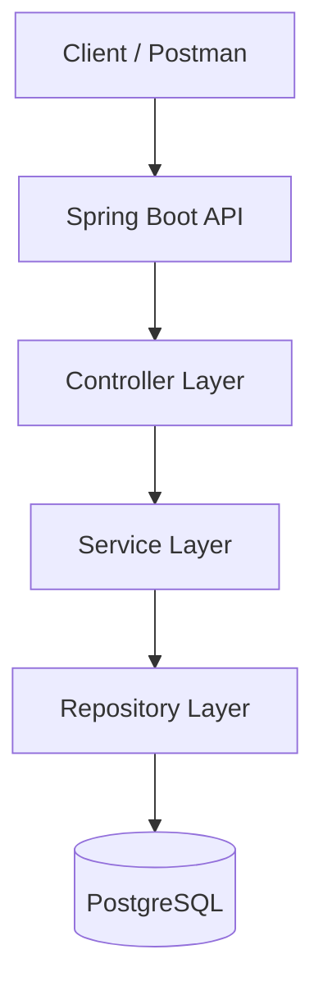
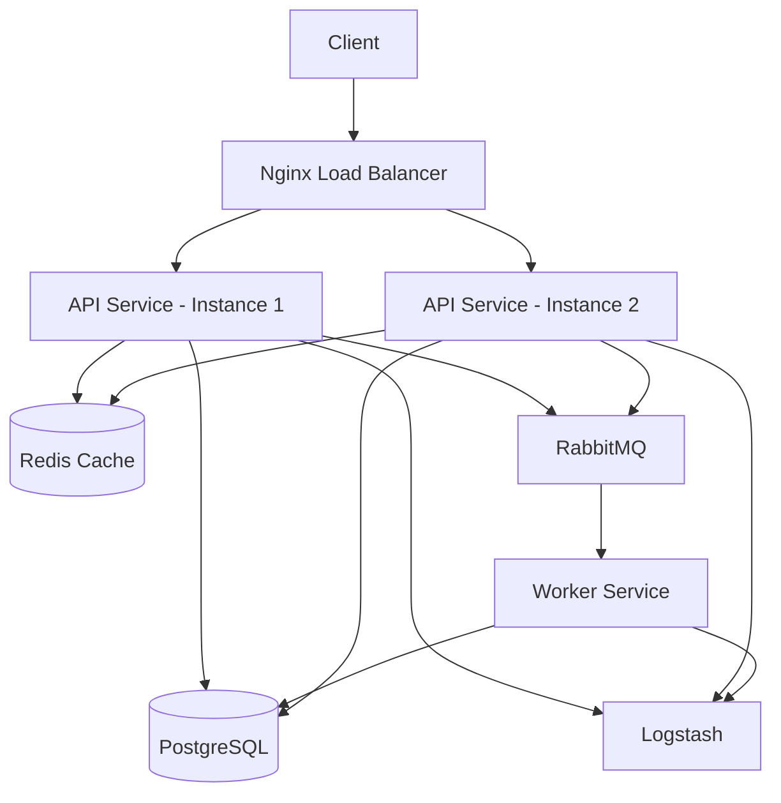
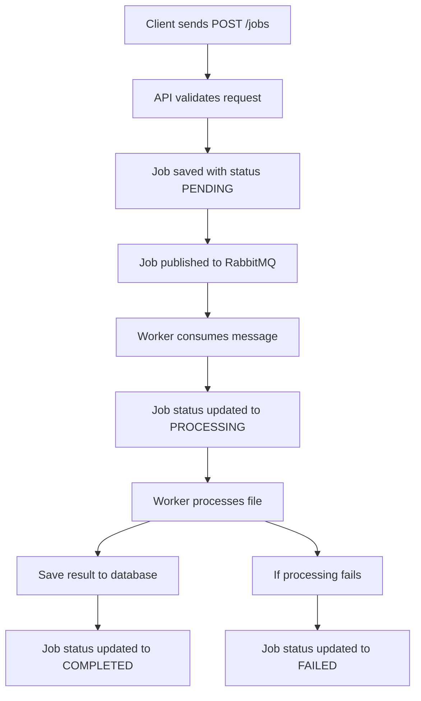
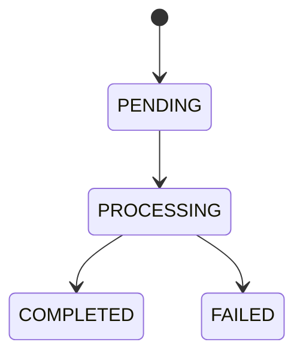

# Document Processing Platform

A Spring Boot backend project to learn software engineering and system design concepts including queues, caching, logging, Docker, load balancing, and memory troubleshooting.

## Phase 1 Features
- Create job
- Get job by id
- List jobs
- PostgreSQL persistence
- Validation and exception handling

## Tech Stack
- Java 17
- Spring Boot
- Spring Data JPA
- PostgreSQL

## Run Locally
1. Create PostgreSQL database `doc_processor`
2. Update datasource config in `application.properties`
3. Run the Spring Boot app
4. Test endpoints in Postman

## Current Architecture

## Target Architecture

## Job Processing Flow

## Job Status Lifecycle

